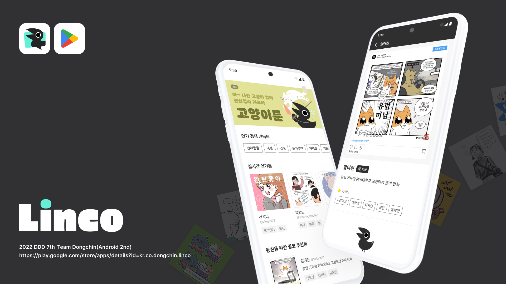
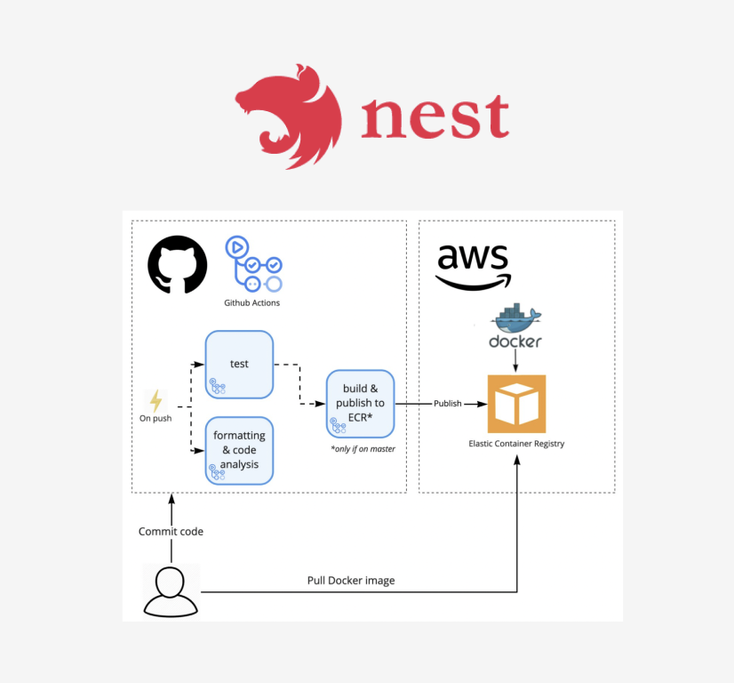
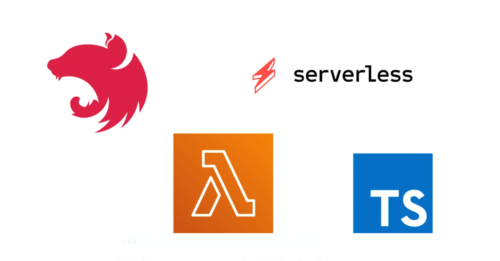

# Dongchin - Server

# **Linco**

> **반짝이는 이야기를 모아서 연결해줄게요!**
>
> **인스타툰과 이어주는 오작교!**

****

****

## **Backend Stack & Libraries 🔨**

- **Nest JS CLI 8.0.0**
- **Typescript <4.8**
- **Github Actions**
- **AWS RDS MYSQL**
- **AWS ECS -> AWS Serverless Lambda**
- **AWS Lambda 1.0.7**

## Architecture (Before)

## Architecture (After)

### **Contributors :sparkles:**

<table>
  <tr>
    <td align="center"><a href="https://github.com/jjjoonngg"> <b>김종신</b></a> <a href="#projectManagement-JJJoonngg" title="Android Dev">💻</a></td>
    <td align="center"><a href="https://github.com/moon-i"> <b>최서문</b></a> <a href="#projectManagement-JJJoonngg" title="Android Dev">💻</a></td>
    <td align="center"><a href="https://github.com/YongsHub"> <b>김태용</b></a> <a href="#projectManagement-JJJoonngg" title=Server Dev">💻</a></td>
  </tr>
</table>
